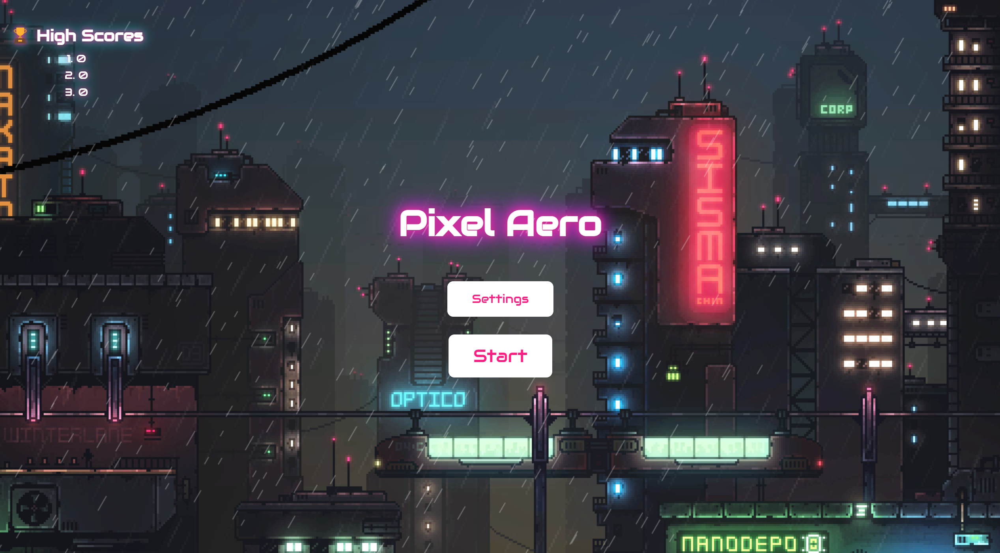

# 🚀 超炫酷星际射击游戏

欢迎来到 **超炫酷星际射击游戏** 的世界！🌌  
在这里，你将驾驶一架帅气的飞机，穿越星际，击败敌人，成为宇宙的英雄！✨  
**带上耳机，沉浸感更佳！🎧**

👉 **点击即玩**：[https://uiosn.github.io/Pixel-Aero/](https://uiosn.github.io/Pixel-Aero/)

---



## 🎮 游戏玩法

1. **WASD 移动**：  
   用你的键盘操控飞机，灵活躲避敌人！🕹️

2. **鼠标点击射击**：  
   用子弹告诉敌人谁才是宇宙的老大！🖱️

3. **空格键暂停**：  
   累了吗？按下空格键，喝口水再战！⏸️

4. **左 Shift 激光波**：  
   当敌人太多时，用激光波清场！⚡（但要省着点用哦~）

---

## 🌟 游戏特色

- **动态背景**：  
  星空、雨丝、光效，视觉效果拉满！🌠

- **多种难度**：  
  - Easy：适合新手，轻松愉快。  
  - Medium：挑战你的反应速度。  
  - Hard：只有真正的宇宙英雄才能通关！💪

- **炫酷光标**：  
  客制光标，让你的操作更有个性！🖱️✨

- **音效炸裂**：  
  子弹声、爆炸声、背景音乐，沉浸感满分！🎵  
  

- **欢迎PR！🤝**

---

## 🛠️ 安装与运行

1. 克隆项目到本地：
   ```bash
   git clone https://github.com/your-repo/space-shooter.git


